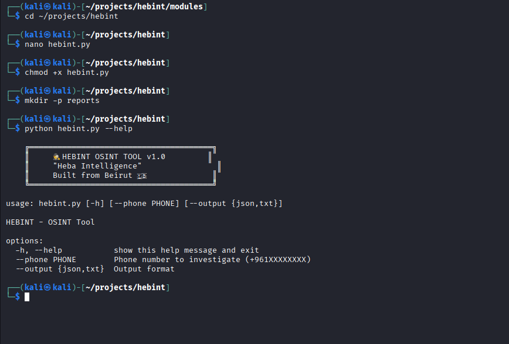
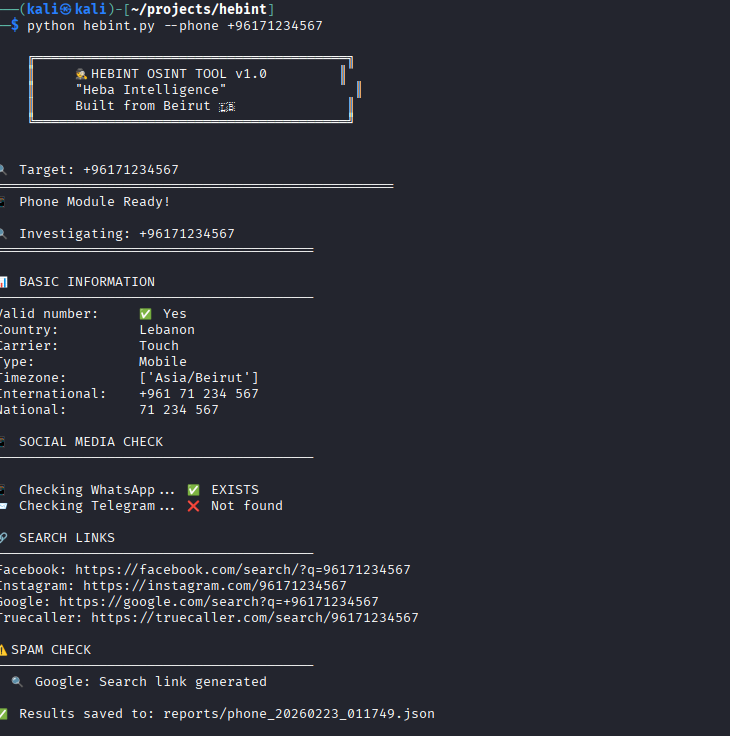

# 🕵️ HEBINT - Advanced OSINT Investigation Tool

<div align="center">
  
  [](https://python.org)
  [](LICENSE)
  []()
  []()
  
  <h3>🔍 Search 150+ platforms for usernames, emails, and phone numbers</h3>
  <p><i>Built with ❤️ in Beirut, Lebanon</i></p>
  
</div>

---


<div align="center">
  
### Main Interface


### Facebook Search Links


### Results Summary


### Email Module Working


### Phone Module Working


### Colors Complete


### Username Search


### Recording Demo


### Working Results


</div>

---

## 📋 Overview

**HEBINT** (pronounced "Heh-bint", short for **He**ba **B**eirut **INT**elligence) is a powerful OSINT tool that automates the process of searching for usernames, emails, and phone numbers across **150+ platforms**. It's designed for security researchers, investigators, and cybersecurity professionals.

### ✨ Key Features

| Feature | Description |
|---------|-------------|
| **150+ Platforms** | Social media, coding sites, gaming, Arabic platforms |
| **Arabic Support** | **UNIQUE!** Searches Anazahra, ArabChat, Mawada, DubaiChat |
| **Colored Output** | Beautiful terminal output with color-coded results |
| **JSON Export** | All results saved to structured JSON files |
| **Facebook Links** | Always visible even without profiles |
| **Concurrent Checks** | 20 simultaneous connections for speed |
| **Email Module** | Email investigation capabilities |
| **Phone Module** | Phone number lookup |

---

# 🕵️ HEBINT-OSINT-Tool - Open Source Intelligence Investigation Platform

## Objective
Build a comprehensive OSINT (Open Source Intelligence) tool that automates the investigation of phone numbers, emails, and usernames across 150+ platforms including social media, coding sites, gaming platforms, and Arabic-specific websites.

## Key Skills Demonstrated
- OSINT investigation techniques (phone, email, username)
- API integration (Truecaller, HaveIBeenPwned, GitHub API)
- Web scraping and data correlation
- Bilingual report generation (Arabic/English)
- Concurrent processing for fast searching
- Database management for spam reports

## My Process
1. **Phone Module**: Parsed phone numbers to extract country, carrier, line type, WhatsApp/Telegram presence
2. **Email Module**: Validated emails, checked domain MX records, Gravatar profiles, and data breaches
3. **Username Module**: Searched 100+ platforms concurrently for username existence
4. **Arabic Platform Support**: Added unique support for Arabic websites (Anazahra, ArabChat, Mawada, DubaiChat)
5. **Reporting**: Generated JSON, HTML, and CSV reports with bilingual support

## Tools Used
- Python 3.11, Requests, JSON, concurrent.futures
- Phonenumbers library, DNS resolver, Hashlib
- Colorama for colored output
- Streamlit for web interface (planned)
- SQLite for database storage

## Key Features
- ✅ **Phone Number Lookup**: Country, carrier, line type, WhatsApp/Telegram, spam reports
- ✅ **Email Investigation**: Validation, MX records, Gravatar, data breaches
- ✅ **Username Search**: 150+ platforms including unique Arabic sites
- ✅ **Bilingual Reports**: Arabic and English support
- ✅ **Concurrent Searching**: 20+ simultaneous checks for speed

## What I Learned
- OSINT requires multiple data sources for accuracy
- Arabic platform support is a unique differentiator
- Concurrent processing dramatically improves performance
- Color-coded output improves readability for SOC analysts
- JSON export enables further analysis and integration

## Challenges Overcome
- Handling API rate limits and blocks (LinkedIn, Truecaller)
- Processing concurrent requests efficiently
- Managing different data formats from various platforms
- Implementing retry logic for failed requests


## 🚀 Quick Start

```bash
# Clone the repository
git clone https://github.com/YOUR_USERNAME/hebint.git
cd hebint

# Set up virtual environment
python3 -m venv venv
source venv/bin/activate  # Linux/macOS
# venv\Scripts\activate   # Windows

# Install dependencies
pip install -r requirements.txt

# Run the tool
python modules/hebint_username.py
